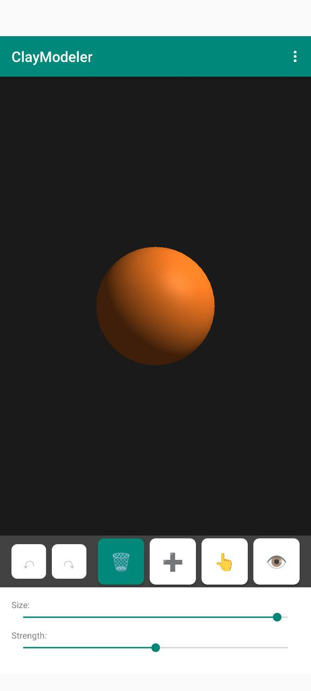

# ClayModeler

An Android app for creating 3D models that can be printed using clay.

## Features

- 🎨 **Intuitive Sculpting** - Remove, add, and pull clay with natural touch gestures
- 🖐️ **Drag-Based Sculpting** - Add and Pull tools respond to finger drag direction for intuitive modeling
- 🛠️ **8 Sculpting Tools** - Remove, Add, Pull, Smooth, Flatten, Pinch, Inflate, and View mode
- 💡 **Per-Model Lighting** - Adjust light position (X/Y/Z) and intensity (0-2x), saved with each model
- 📚 **Example Models** - 5 built-in examples to learn sculpting techniques
- 🔄 **Undo/Redo** - Up to 20 levels of undo history
- 💾 **Save/Load** - Save your models in custom .clay format
- 📤 **STL Export** - Export models for 3D printing (50-200mm)
- 💫 **Auto-Save** - Automatic backup every minute
- 👁️ **View Mode** - Examine your model with camera controls (pinch zoom, rotate, pan, double-tap reset)
- 🎯 **Visual Cursor** - See tool size and position in real-time

## Screenshots



*Main screen with sculpting tools and adjustable brush size/strength*

## System Requirements

- Android 8.0 (API 26) or higher
- OpenGL ES 3.0 support
- 2GB RAM minimum

## Installation

### From GitHub Releases

1. Download the latest APK from [Releases](https://github.com/yourusername/ClayModeler/releases)
2. Enable "Install from Unknown Sources" in Android settings
3. Install the APK

## Building from Source

### Prerequisites

- Android SDK (API 26+)
- Java 21
- Gradle 8.13+

### Build Instructions

```bash
# Clone repository
git clone https://github.com/yourusername/ClayModeler.git
cd ClayModeler

# Build debug APK
./gradlew assembleDebug

# Build release APK
./gradlew assembleRelease

# Run unit tests
./gradlew testDebugUnitTest

# Run lint checks
./gradlew lintDebug
```

The APK will be in `app/build/outputs/apk/`

## Testing

### Unit Tests

```bash
./gradlew testDebugUnitTest
```

### Integration Tests

```bash
./gradlew connectedDebugAndroidTest
```

### Local Headless Emulator

```bash
./test-with-emulator.sh
```

This script:
- Checks for KVM availability
- Creates an AVD if needed
- Starts headless emulator
- Runs integration tests
- Cleans up

#### Manual Emulator Commands

Create AVD manually:
```bash
avdmanager create avd -n ClayModeler_Test \
  -k "system-images;android-29;default;x86_64" \
  -d pixel_3a
```

Start emulator headless:
```bash
emulator -avd ClayModeler_Test -no-window -no-audio -no-boot-anim -gpu swiftshader_indirect
```

Run tests:
```bash
./gradlew connectedDebugAndroidTest
```

Stop emulator:
```bash
adb emu kill
```

## Usage

### Getting Started

1. Launch the app - you'll see a clay sphere
2. Select a tool from the toolbar
3. Touch and drag to sculpt
4. Use pinch to zoom, drag to rotate
5. Save your work via the menu

### Tools

- **Remove (🗑️)** - Carve clay inward toward hit point with smooth falloff
- **Add (➕)** - Build clay in drag direction (or outward if tapped) - responds to finger movement
- **Pull (👆)** - Pull clay in drag direction - follows your finger for precise control
- **Smooth (〰️)** - Average neighboring vertices for polished surfaces using Laplacian smoothing
- **Flatten (▬)** - Create flat surfaces and planes - defines plane on first touch
- **Pinch (🤏)** - Pull vertices toward center with quadratic falloff for sharp details
- **Inflate (🎈)** - Uniform expansion along surface normals for rounded, organic forms
- **View (👁️)** - Examine without editing - rotate, zoom, pan, double-tap to reset

### Camera Controls

- **Single finger drag** - Rotate camera (or edit in tool mode)
- **Pinch** - Zoom in/out (0.5x to 5x scale)
- **Two finger drag** - Pan camera
- **Double tap** - Reset camera to default view (View mode only)

### Settings

- **Brush Size** - Adjust tool radius (0.1 - 2.0)
- **Strength** - Control modification intensity (0.1 - 1.0)
- **Lighting** - Adjust light position (X/Y/Z: -5.0 to 5.0) and intensity (0.0 - 2.0)
  - Default position: (2.0, 3.0, 2.0)
  - Default intensity: 1.0
  - Settings saved per-model

### File Formats

#### .clay Format

Custom binary format:
- Magic number: "CLAY" (0x434C4159)
- Version: 1
- Metadata: Key-value pairs
- Data: Vertices, faces, normals (little-endian)
- Checksum: CRC32 for integrity

#### .stl Format

Standard STL for 3D printing:
- Binary format (little-endian)
- Coordinate system: Z-up
- Configurable size: 50-200mm
- Saved to Downloads folder

## Release Procedure

1. Update version in `build.gradle.kts`
2. Update `CHANGELOG.md`
3. Commit changes
4. Create tag: `git tag -a v1.0.0 -m "Release 1.0.0"`
5. Push tag: `git push origin v1.0.0`
6. GitHub Actions builds and creates release
7. Download APK from releases
8. Test release APK
9. Announce release

## Troubleshooting

### App crashes on startup
- Check Android version (8.0+ required)
- Verify OpenGL ES 3.0 support
- Clear app data and restart

### Export fails
- Check storage permissions
- Ensure sufficient storage space
- Try smaller model size

### Performance issues
- Reduce model complexity
- Lower subdivision level
- Close background apps

## TODO

1. ~~**Screenshots**~~ - ✅ Completed
2. ~~**Custom App Icon**~~ - ✅ Completed
3. ~~**Additional Tools**~~ - ✅ Completed (Smooth, Flatten, Pinch, Inflate)
4. ~~**Lighting Controls**~~ - ✅ Completed (Per-model lighting with position and intensity)
5. ~~**Example Models**~~ - ✅ Completed (5 built-in examples)
6. **Enhanced Examples** - Create more detailed example models using the sculpting tools
7. **Tool Presets** - Save and load tool size/strength configurations
8. **Multiple Light Sources** - Add support for additional lights

## License

MIT License - see LICENSE file

## Privacy

ClayModeler does not collect any user data. All files are stored locally on your device. Crash reports are only shared if you choose to send them.
